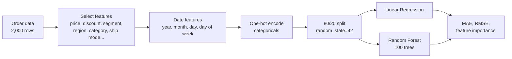

# 📈 Product Demand Forecasting

**Predicting how many units an order will contain from price, discount, product and calendar features**, comparing a linear baseline against a Random Forest.


**Jump to:** [Approach](#-approach) · [Results](#-results) · [What the results mean](#-what-the-results-mean) · [Run it](#-run-it)

---

## 🎯 Goal

Estimate `Quantity` (units per order) from historical retail order data to support inventory planning.

## 🧭 Approach



- **Data:** 2,000 retail orders. Target `Quantity` ranges from 1 to 15 (mean 7.99, std 4.33).
- **Features:** unit price, discount, ship mode, order priority, customer segment, region, category, sub-category, plus year, month, day and day-of-week extracted from the order date.
- **Models:** Linear Regression (baseline) and `RandomForestRegressor(n_estimators=100)`.
- **Metrics:** MAE and RMSE on the held-out 20%.

---

## 📊 Results

| Model | MAE | RMSE |
|---|---|---|
| Linear Regression | **3.97** | **4.54** |
| Random Forest | 3.98 | 4.59 |

Top Random Forest feature importances: `Unit_Price` (0.20), `day` (0.14), `month` (0.09), `day_of_week` (0.08), `Discount` (0.06).

---

## 🧐 What the results mean

- **The two models perform about the same**, and the linear baseline is marginally better. The Random Forest did **not** outperform it here.
- **Neither model beats a naive baseline.** `Quantity` has a standard deviation of 4.33, and both models have an RMSE above that (4.54 and 4.59). In other words, they are no better than always predicting the average order size.
- So the feature importances should not be read as demand drivers: when a model has almost no predictive signal, importances mostly reflect noise fitting. The high ranking of `day` (day of month) is a hint of that.
- **Likely reason:** in this dataset, `Quantity` appears to be spread evenly between 1 and 15 with little relationship to the available features.

This makes it a clean, honest example of the regression workflow (feature engineering, encoding, train/test evaluation, model comparison) and of checking a model against a baseline. It is not a usable forecasting model.

### What I would do next

- Add a **mean-prediction baseline** to the notebook so the comparison is explicit.
- Use a **time-based split** and aggregate demand per product per week or month, since order-level quantity is close to random here.
- Try lag features and a real time-series model on data with genuine seasonality.

---

## 🚀 Run it

```bash
git clone https://github.com/Sajal-10903/Product_Demand_Forecasting_ML.git
cd Product_Demand_Forecasting_ML
pip install -r requirements.txt
jupyter notebook Product_Demand_Forecasting.ipynb
```

The dataset is not included in the repository. The notebook reads it from `data/sales.csv`, so create a `data/` folder and place the retail orders CSV there (columns: Order_Date, Ship_Mode, Order_Priority, Segment, Region, Category, Sub_Category, Unit_Price, Discount, Quantity, and others).

---

**Author:** [Sajal Raj](https://github.com/Sajal-10903) · [Portfolio](https://sajalraj-portfolio.vercel.app) · [LinkedIn](https://www.linkedin.com/in/sajal-raj-456b31252/)
